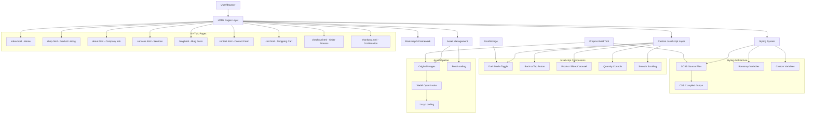
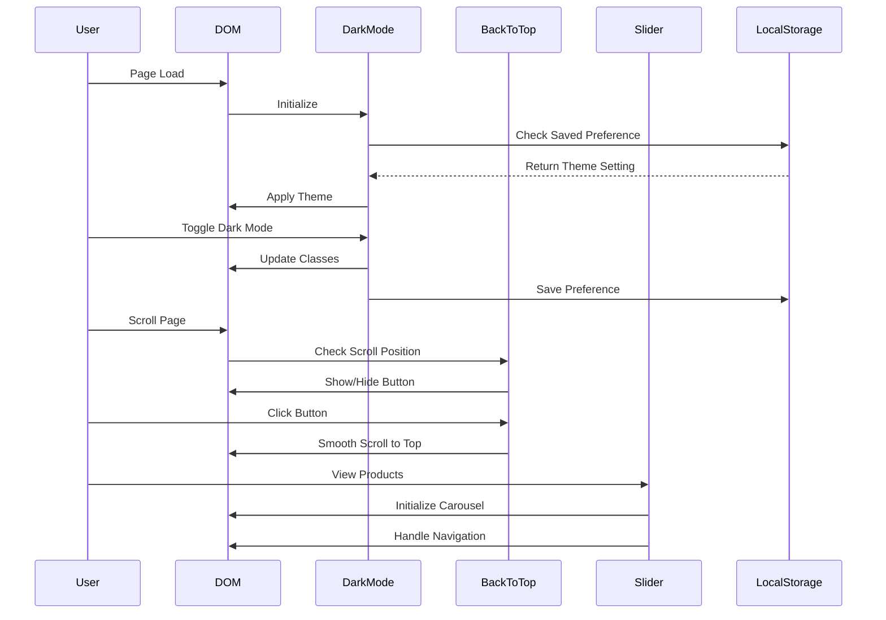
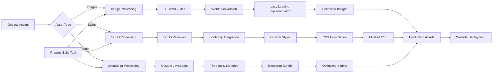
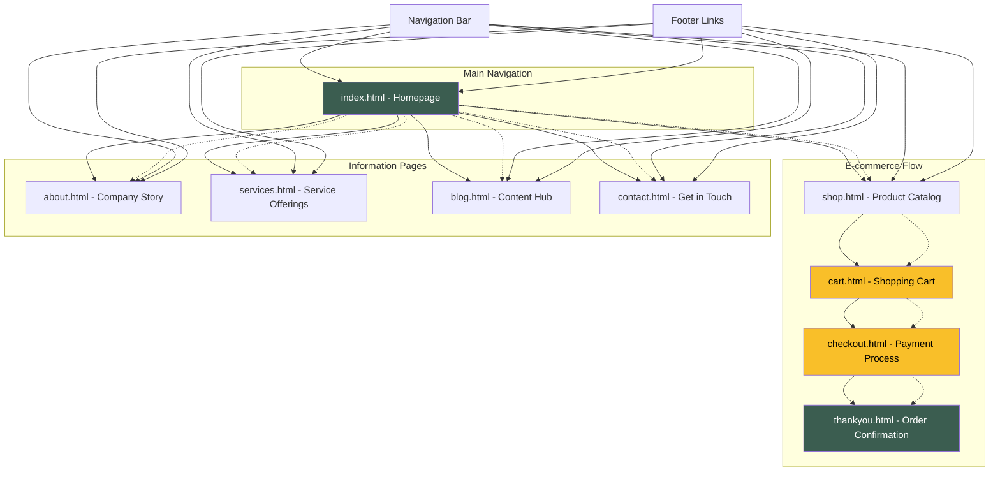

# Furni - Modern Furniture Website Template

A responsive furniture and interior design website template built with Bootstrap 5. This project has been enhanced with modern features including dark mode, optimized images, and improved accessibility.

## Features

- 📱 **Fully Responsive Design** - Works perfectly on desktop, tablet, and mobile devices
- 🌙 **Dark Mode Toggle** - Switch between light and dark themes with preference persistence
- 🚀 **Optimized Performance** - WebP images with lazy loading for faster load times
- ⬆️ **Back to Top Button** - Smooth scroll to top functionality on all pages
- 🛒 **E-commerce Pages** - Shop, cart, checkout, and product pages included
- 📝 **Blog & Content Pages** - About, services, blog, and contact pages
- ♿ **Accessibility** - Proper alt tags, semantic HTML, and keyboard navigation
- 🎨 **Modern Design** - Clean, professional layout with excellent typography

## Pages Included

- **Home** (`index.html`) - Main landing page with hero section and product showcase
- **Shop** (`shop.html`) - Product listing page
- **About** (`about.html`) - Company information and team
- **Services** (`services.html`) - Service offerings
- **Blog** (`blog.html`) - Blog listing page
- **Contact** (`contact.html`) - Contact form and information
- **Cart** (`cart.html`) - Shopping cart page
- **Checkout** (`checkout.html`) - Order checkout process
- **Thank You** (`thankyou.html`) - Order confirmation page

## Quick Start

1. **Download or clone** this repository
2. **Navigate** to the project directory
3. **Start a local server**:
   ```bash
   python3 -m http.server 8000
   ```
4. **Open your browser** and go to `http://localhost:8000`

## File Structure

```
furni-1.0.0/
├── css/
│   ├── bootstrap.min.css
│   ├── style.css
│   └── tiny-slider.css
├── js/
│   ├── bootstrap.bundle.min.js
│   ├── custom.js
│   └── tiny-slider.js
├── images/
│   ├── *.jpg (original images)
│   ├── *.png (original images)
│   ├── *.webp (optimized images)
│   └── *.svg (vector icons)
├── scss/
│   └── style.scss
├── *.html (all page templates)
└── README.md
```

## Customization

### Colors and Styling
- Main stylesheet: `css/style.css`
- SCSS source: `scss/style.scss`
- Primary color: `#3b5d50`
- Accent color: `#f9bf29`

### Dark Mode
The dark mode feature automatically:
- Saves user preference in localStorage
- Switches icon between sun (🌞) and moon (🌙)
- Applies dark theme to all elements
- Works consistently across all pages

### Image Optimization
Images are optimized using WebP format with lazy loading:
- Original images maintained as fallbacks
- WebP versions provide ~30% better compression
- Lazy loading improves initial page load time

## Browser Support

- Chrome (latest)
- Firefox (latest)
- Safari (latest)
- Edge (latest)
- Internet Explorer 11+ (with graceful degradation)

## Dependencies

- **Bootstrap 5** - CSS framework
- **Font Awesome 6** - Icons
- **Tiny Slider** - Product carousel
- **Google Fonts** - Inter font family

## Performance Optimizations

- ✅ WebP image format with fallbacks
- ✅ Lazy loading for images
- ✅ Minified CSS and JavaScript
- ✅ Efficient font loading
- ✅ Semantic HTML structure
- ✅ Proper meta tags for SEO

## Architecture

This section provides visual representations of the project's architecture to help stakeholders and developers understand the system structure, component relationships, and data flow.

### System Architecture Overview

The following diagram shows the overall structure of the Furni website template, including all major components and their relationships:



### Component Interaction Flow

This diagram illustrates how different JavaScript components interact with the DOM and user actions:



### Asset Processing Pipeline

This diagram shows how images and styles are processed and optimized:



### Page Navigation Hierarchy

This diagram shows the relationship between different pages and user navigation flows:



### Technology Stack Overview

This diagram presents the technical foundation and dependencies:

```mermaid
graph TB
    subgraph "Frontend Framework"
        A[Bootstrap 5.3.x]
        A1[Responsive Grid System]
        A2[UI Components]
        A3[JavaScript Plugins]
        A --> A1 & A2 & A3
    end
    
    subgraph "Styling Technology"
        B[SCSS/Sass]
        B1[Variables & Mixins]
        B2[Nested Rules]
        B3[Custom Themes]
        B --> B1 & B2 & B3
    end
    
    subgraph "JavaScript Libraries"
        C[Tiny Slider 2.x]
        C1[Product Carousels]
        C2[Touch/Swipe Support]
        C3[Responsive Breakpoints]
        C --> C1 & C2 & C3
    end
    
    subgraph "Icon System"
        D[Font Awesome 6.x]
        D1[Social Media Icons]
        D2[UI Action Icons]
        D3[Navigation Icons]
        D --> D1 & D2 & D3
    end
    
    subgraph "Build Tools"
        E[Prepros 6.x]
        E1[SCSS Compilation]
        E2[Asset Optimization]
        E3[Live Reload]
        E --> E1 & E2 & E3
    end
    
    subgraph "Performance Features"
        F[Image Optimization]
        F1[WebP Format]
        F2[Lazy Loading]
        F3[Responsive Images]
        F --> F1 & F2 & F3
    end
    
    G[Modern Web Browser] --> A & B & C & D & F
    H[Development Environment] --> E
```



### Business Value & Benefits

Each architectural component delivers specific business value:

- **Responsive Design**: Ensures optimal user experience across all devices, increasing customer engagement
- **Dark Mode**: Modern UX feature that improves accessibility and user preference accommodation  
- **Image Optimization**: Faster page loads lead to better SEO rankings and reduced bounce rates
- **E-commerce Flow**: Streamlined purchase process from product discovery to order confirmation
- **Component Architecture**: Modular design enables easy maintenance and feature additions
- **Performance Optimization**: Fast loading times improve conversion rates and user satisfaction

## Credits

**Original Template**: Furni by Untree.co  
**Enhanced by**: shubhendu for GitHub Demo  
**License**: Creative Commons Attribution 3.0

## License

This project is licensed under the Creative Commons Attribution 3.0 License - see the [license information](https://creativecommons.org/licenses/by/3.0/) for details.

## Contributing

Feel free to submit issues and enhancement requests!

---

**Designed by shubhendu for GitHub Demo**
