# Furni - Modern Furniture Website Template

A responsive furniture and interior design website template built with Bootstrap 5. This project has been enhanced with modern features including dark mode, optimized images, and improved accessibility.

## Features

- 📱 **Fully Responsive Design** - Works perfectly on desktop, tablet, and mobile devices
- 🌙 **Dark Mode Toggle** - Switch between light and dark themes with preference persistence
- 🚀 **Optimized Performance** - WebP images with lazy loading for faster load times
- ⬆️ **Back to Top Button** - Smooth scroll to top functionality on all pages
- 🛒 **E-commerce Pages** - Shop, cart, checkout, and product pages included
- 📝 **Blog & Content Pages** - About, services, blog, and contact pages
- ♿ **Accessibility** - Proper alt tags, semantic HTML, and keyboard navigation
- 🎨 **Modern Design** - Clean, professional layout with excellent typography

## Pages Included

- **Home** (`index.html`) - Main landing page with hero section and product showcase
- **Shop** (`shop.html`) - Product listing page
- **About** (`about.html`) - Company information and team
- **Services** (`services.html`) - Service offerings
- **Blog** (`blog.html`) - Blog listing page
- **Contact** (`contact.html`) - Contact form and information
- **Cart** (`cart.html`) - Shopping cart page
- **Checkout** (`checkout.html`) - Order checkout process
- **Thank You** (`thankyou.html`) - Order confirmation page

## Quick Start

1. **Download or clone** this repository
2. **Navigate** to the project directory
3. **Start a local server**:
   ```bash
   python3 -m http.server 8000
   ```
4. **Open your browser** and go to `http://localhost:8000`

## File Structure

```
furni-1.0.0/
├── css/
│   ├── bootstrap.min.css
│   ├── style.css
│   └── tiny-slider.css
├── js/
│   ├── bootstrap.bundle.min.js
│   ├── custom.js
│   └── tiny-slider.js
├── images/
│   ├── *.jpg (original images)
│   ├── *.png (original images)
│   ├── *.webp (optimized images)
│   └── *.svg (vector icons)
├── scss/
│   └── style.scss
├── *.html (all page templates)
└── README.md
```

## Customization

### Colors and Styling
- Main stylesheet: `css/style.css`
- SCSS source: `scss/style.scss`
- Primary color: `#3b5d50`
- Accent color: `#f9bf29`

### Dark Mode
The dark mode feature automatically:
- Saves user preference in localStorage
- Switches icon between sun (🌞) and moon (🌙)
- Applies dark theme to all elements
- Works consistently across all pages

### Image Optimization
Images are optimized using WebP format with lazy loading:
- Original images maintained as fallbacks
- WebP versions provide ~30% better compression
- Lazy loading improves initial page load time

## Browser Support

- Chrome (latest)
- Firefox (latest)
- Safari (latest)
- Edge (latest)
- Internet Explorer 11+ (with graceful degradation)

## Dependencies

- **Bootstrap 5** - CSS framework
- **Font Awesome 6** - Icons
- **Tiny Slider** - Product carousel
- **Google Fonts** - Inter font family

## Performance Optimizations

- ✅ WebP image format with fallbacks
- ✅ Lazy loading for images
- ✅ Minified CSS and JavaScript
- ✅ Efficient font loading
- ✅ Semantic HTML structure
- ✅ Proper meta tags for SEO

## Credits

**Original Template**: Furni by Untree.co  
**Enhanced by**: shubhendu for GitHub Demo  
**License**: Creative Commons Attribution 3.0

## License

This project is licensed under the Creative Commons Attribution 3.0 License - see the [license information](https://creativecommons.org/licenses/by/3.0/) for details.

## Architecture

This section provides a comprehensive overview of the Furni website template's architecture, designed to help business stakeholders and developers understand the system structure, component relationships, and data flow.

### System Architecture Overview

```mermaid
graph TB
    subgraph "User Interface Layer"
        U[👤 User] --> B[🌐 Browser]
        B --> HP[🏠 Web Pages]
    end
    
    subgraph "Page Structure (9 Pages)"
        HP --> HOME[📄 index.html<br/>Landing Page]
        HP --> SHOP[🛍️ shop.html<br/>Product Catalog]
        HP --> ABOUT[ℹ️ about.html<br/>Company Info]
        HP --> SERV[⚙️ services.html<br/>Service Offerings]
        HP --> BLOG[📝 blog.html<br/>Content Hub]
        HP --> CONTACT[📞 contact.html<br/>Contact Form]
        HP --> CART[🛒 cart.html<br/>Shopping Cart]
        HP --> CHECK[💳 checkout.html<br/>Payment Process]
        HP --> THANKS[✅ thankyou.html<br/>Confirmation]
    end
    
    subgraph "JavaScript Features"
        HP --> DM[🌙 Dark Mode Toggle]
        HP --> BTT[⬆️ Back to Top]
        HP --> SLIDER[🎠 Testimonial Slider]
        HP --> QTY[➕➖ Quantity Controls]
        
        DM --> LS[💾 localStorage<br/>Theme Persistence]
        BTT --> SCROLL[📜 Scroll Detection]
        SLIDER --> TNS[🔄 Tiny Slider Library]
        QTY --> CART_LOGIC[🧮 Cart Logic]
    end
    
    subgraph "Styling System"
        SCSS[📝 SCSS Source] --> PREPROS[⚙️ Prepros Compiler]
        PREPROS --> CSS[🎨 style.css]
        CSS --> BS5[🅱️ Bootstrap 5]
        CSS --> FA[🎯 Font Awesome 6]
        CSS --> GF[🔤 Google Fonts]
        BS5 --> HP
        FA --> HP
        GF --> HP
    end
    
    subgraph "Asset Optimization Pipeline"
        ORIG[📸 Original Images<br/>JPG/PNG] --> WEBP[🗜️ WebP Conversion<br/>~30% smaller]
        WEBP --> LAZY[⏳ Lazy Loading<br/>Performance]
        LAZY --> HP
        SVG[🎨 SVG Icons] --> HP
    end
    
    subgraph "Development Workflow"
        DEV[👨‍💻 Developer] --> LOCAL[💻 Local Development]
        LOCAL --> PREPROS
        LOCAL --> LIVE[🔄 Live Reload]
        LIVE --> TEST[🧪 Browser Testing]
        TEST --> BUILD[📦 Build Process]
        BUILD --> DEPLOY[🚀 Deployment]
    end
    
    style U fill:#e1f5fe
    style HP fill:#f3e5f5
    style DM fill:#fff3e0
    style WEBP fill:#e8f5e8
    style CSS fill:#fce4ec
```



### Component Interaction Flow


### Asset Processing Workflow

```mermaid
flowchart LR
    subgraph "Original Assets"
        JPG[📸 JPG Images]
        PNG[🖼️ PNG Images]
        SVG[🎨 SVG Icons]
    end
    
    subgraph "Optimization Process"
        JPG --> WEBP_CONV[🗜️ WebP Converter]
        PNG --> WEBP_CONV
        WEBP_CONV --> WEBP[📱 WebP Images<br/>30% smaller]
        SVG --> OPTIMIZE[⚡ SVG Optimization]
    end
    
    subgraph "Delivery Strategy"
        WEBP --> LAZY_LOAD[⏳ Lazy Loading]
        OPTIMIZE --> DIRECT[📤 Direct Loading]
        LAZY_LOAD --> FALLBACK[🔄 JPG/PNG Fallback]
        DIRECT --> CACHE[💾 Browser Cache]
        FALLBACK --> CACHE
    end
    
    subgraph "Performance Benefits"
        CACHE --> FAST[⚡ Fast Loading]
        FAST --> BETTER_UX[😊 Better User Experience]
        FAST --> SEO[📈 Improved SEO]
    end
```



### Technical Architecture Explanation

#### **Frontend Layer (User Interface)**
- **9 Responsive HTML Pages**: Complete e-commerce flow from product browsing to checkout
- **Bootstrap 5 Framework**: Ensures consistent, mobile-first responsive design
- **Font Integration**: Google Fonts (Inter) and Font Awesome 6 icons for professional appearance

#### **Interactive Features (JavaScript)**
- **Dark Mode Toggle**: User preference saved in browser localStorage with automatic theme switching
- **Back-to-Top Button**: Appears on scroll for better navigation experience
- **Product Sliders**: Automated testimonial rotation using Tiny Slider library
- **Cart Controls**: Interactive quantity selectors with real-time updates

#### **Asset Management Pipeline**
- **Image Optimization**: Automatic conversion from JPG/PNG to WebP format (30% size reduction)
- **Lazy Loading**: Images load only when needed, improving initial page performance
- **Fallback Strategy**: Graceful degradation to original formats for older browsers
- **SVG Icons**: Scalable vector graphics for crisp icons at any resolution

#### **Styling System (CSS/SCSS)**
- **SCSS Source Files**: Maintainable, variable-driven styling with nesting and mixins
- **Prepros Compilation**: Automated SCSS to CSS conversion with autoprefixing
- **Component Architecture**: Modular styling approach for easy maintenance
- **Color System**: Consistent brand colors with dark mode variations

#### **Development Workflow**
- **Local Development**: Live reload for immediate feedback during development
- **Build Process**: Automated compilation, optimization, and minification
- **Cross-browser Testing**: Ensures compatibility across modern browsers
- **Performance Optimization**: Minified assets and optimized delivery

### Business Value

#### **For Stakeholders**
- **Visual Clarity**: Easy-to-understand system overview for technical discussions
- **Scalability Planning**: Clear component structure for future enhancements
- **Performance Metrics**: Built-in optimizations improve user experience and SEO

#### **For Developers**
- **Quick Onboarding**: New team members can understand structure immediately
- **Maintenance Guide**: Clear separation of concerns simplifies updates
- **Extension Points**: Well-defined architecture supports feature additions

#### **For Users**
- **Fast Loading**: Optimized assets and lazy loading ensure quick page loads
- **Consistent Experience**: Dark mode and responsive design work across all devices
- **Smooth Interactions**: Progressive enhancement provides engaging user experience

## Contributing

Feel free to submit issues and enhancement requests!

---

**Designed by shubhendu for GitHub Demo**
